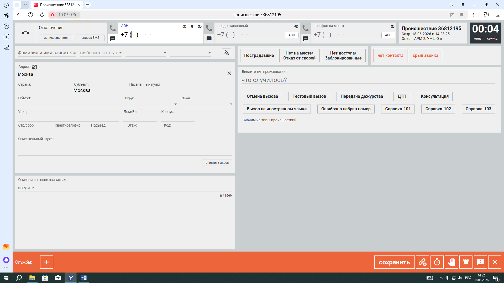
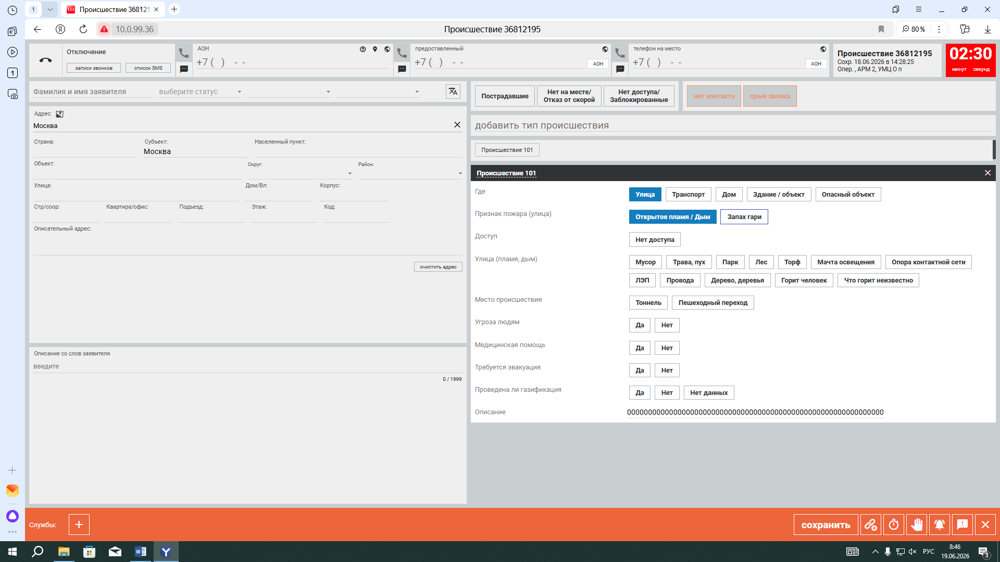
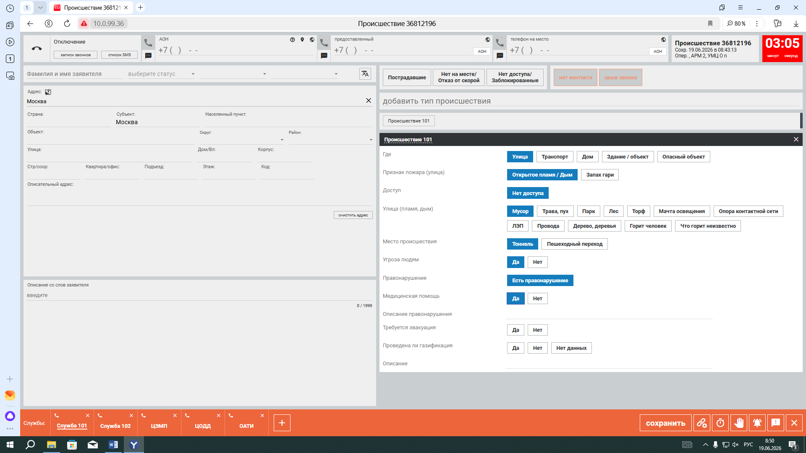
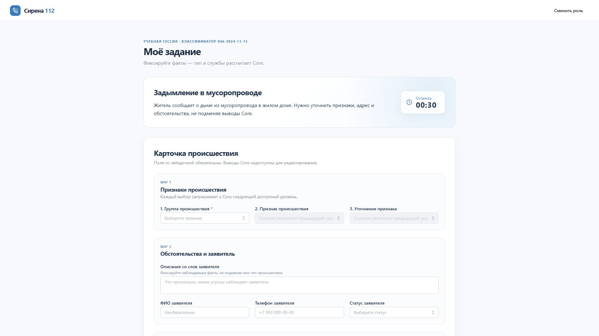
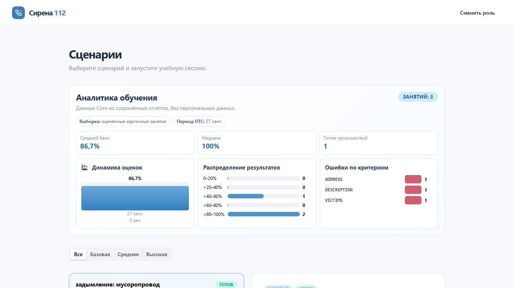

# Web

Frontend Сирены-112 на React, TypeScript, Vite, React Router и Mantine. По
умолчанию он работает без backend, но экраны уже используют интерфейсы API и не
зависят от конкретного транспорта.

## Установка и запуск

Нужны Node.js 20.19+ и npm. Из корня репозитория:

```bash
npm --prefix apps/web install
npm --prefix apps/web run dev
```

Откройте `http://localhost:5173/login`. Vite поддерживает прямой вход и обновление
SPA-маршрутов `/admin`, `/teacher` и `/student`. На другом web-сервере потребуется
аналогичный fallback на `index.html`.

## Режимы API

Режим задаётся при запуске через переменные окружения:

| Переменная | Значения | По умолчанию |
| --- | --- | --- |
| `VITE_API_MODE` | `mock` или `api` | `mock` |
| `VITE_API_BASE_URL` | URL Core API без обязательного завершающего `/` | В API-режиме — текущий origin (Vite proxy); в mock — `http://localhost:8080` |

Mock-режим не требует backend:

```powershell
$env:VITE_API_MODE = 'mock'
npm --prefix apps/web run dev
```

Подключение Kotlin Core API:

```powershell
$env:VITE_API_MODE = 'api'
npm --prefix apps/web run dev
```

В режиме `api` Vite проксирует `/api` и `/ws` на Core (`127.0.0.1:8080`),
поэтому браузеру не нужен CORS. Для размещения Web отдельно от Core задайте
`VITE_API_BASE_URL` или настройте такие же маршруты на обратном прокси.
После изменения переменных перезапустите Vite: он считывает `VITE_*` при старте.
Файл `.env` не обязателен.

## Архитектура интеграции

- `src/api/types.ts` — общие модели `Scenario`, `Session`, `OperatorCardInput`,
  `CardCalculation`, динамической формы и
  `SessionReport`, сверенные с `contracts/openapi.yaml` и
  `contracts/scenario.schema.json`.
- `src/api/httpClient.ts` — единый JSON transport, base URL, cookies и перевод
  сетевых/HTTP-сбоев в `ApiError`.
- `src/api/errors.ts` — единое отображение API-ошибок для экранов.
- `src/api/config.ts` — выбор `mock`/`api` и базового URL.
- `src/features/*/api/*Api.ts` — runtime-переключатели реализаций.
- `src/features/*/api/*HttpApi.ts` — адаптеры маршрутов Core API.
- `src/features/*/api/*MockApi.ts` — автономные реализации с теми же интерфейсами.

React-компоненты получают `TeacherApi` или `StudentApi`; для замены транспорта
или уточнения wire-формата менять экраны не нужно.

## Соответствие контрактам

Fixture-сценарии используют коды `category`, обязательные `groundTruth` и
`rubric.criteria` из `scenario.schema.json`. Общие session/report-модели вынесены
из feature-компонентов и соответствуют схемам OpenAPI.

Student flow следует контракту карточки 0.3:

- `GET .../card-form` возвращает доступные уровни признаков и зависимые вопросы;
- `PATCH .../card` и `POST .../submit` получают только `{ input, expectedRevision }`;
- `incidentType`, код классификатора и службы берутся только из
  `card.calculation` и показываются без возможности редактирования;
- адрес хранит обязательный `displayAddress` и отдельные структурированные поля,
  без внешнего геокодинга;
- `startedAt`, `endedAt`, `timeLimitSeconds` и `timeLimitExceeded` используются
  для фактической длительности и явного отображения превышения.

Core реализует описанный в OpenAPI `GET /api/student/assignments` и возвращает
активные или уже оценённые карточные сессии. При `404` student HTTP-адаптер
сохраняет совместимость со старыми стендами: восстанавливает id запущенной
teacher-сессии из локального кэша и запрашивает состояние через
`GET /api/student/sessions/{id}`. Fallback изолирован в адаптере и не попадает в UI.

Экран преподавателя хранит id последней созданной сессии и восстанавливает её
через `GET /api/teacher/sessions/{id}`. Назначения ДДС загружаются из
`GET /api/teacher/sessions/{id}/service-assignments`: для каждой службы видны
текущий статус, время последнего изменения и полная история. Пустой список до
отправки карточки показывается как штатное состояние, а не ошибка.

В API-режиме экран подписывается на `/ws/sessions/{id}/events`. Повторные
`eventId` из replay/reconnect отбрасываются, а новое событие инициирует чтение
актуальной сессии и назначений из Core — переходы статусов во frontend не
вычисляются. При разрыве WebSocket последнее состояние остаётся на экране,
показывается мягкий статус переподключения и продолжается резервный HTTP-опрос
раз в 3 секунды. Поэтому сохранённая оценка `SCORED` появляется без reload и
восстанавливается после обновления страницы.

Остальные известные пробелы изолированы аналогично:

- Статус готовности сценария отсутствует в `Scenario`; HTTP-адаптер считает
  полученные от teacher endpoint сценарии готовыми. Mock дополнительно показывает
  черновик.
- Endpoint списка или поиска текущей teacher-сессии отсутствует; HTTP-клиент
  сохраняет id последней созданной сессии локально до «Нового занятия».
  Состояние не восстанавливается в новом браузере без локального id.

Изменять общие контракты для этих уточнений следует отдельно, после согласования.

## Проверка полного mock-пути

1. Откройте `/teacher`, выберите сценарий «Задымление в мусоропроводе»
   (`1050602`) и нажмите «Запустить занятие».
2. Перейдите на `/student`: mock-клиент подхватит ту же сессию и сценарий.
3. Последовательно выберите «Жилой дом → Мусоропровод → Дым». Ответьте на
   появившиеся вопросы, заполните адрес и сведения о пострадавших.
4. Убедитесь, что тип и службы появились в read-only блоке Core, дождитесь
   статуса сохранения и отправьте карточку на оценку.
5. Проверьте итоговый отчёт с фактической длительностью, баллами, ошибками и
   рекомендациями.
6. Вернитесь на `/teacher`: сохранённая оценка и назначения служб появятся
   автоматически. Раскройте историю одной службы и завершите занятие при
   необходимости.

Mock-сессия, черновик и отчёт сохраняются в `localStorage`. Запуск нового занятия
очищает предыдущий student draft. Интеграционный тест `src/features/mockFlow.test.tsx`
проверяет связь teacher → student → report.

## Эталон рабочего стола оператора для #60

Эталон зафиксирован 22.09.2026 по `КАРТОЧКА 112.docx` и `СЛУЖБЫ 112.docx`
из `C:\Dev\refs`. Он относится к активной карточке на `/student`, а не к экранам
входа, преподавателя, администратора или итогового отчёта. Выбраны ровно три
репрезентативных кадра, без разбора повторяющихся шагов опроса:

| Состояние | Кадр | Что фиксирует |
| --- | --- | --- |
| Пустая карточка | [01-empty-card.png](docs/reference/01-empty-card.png) (`КАРТОЧКА 112.docx`, `word/media/image1.png`) | Общая геометрия: полоса телефонии, номер и таймер сверху, две рабочие колонки, службы и действия снизу. |
| Карточка в процессе опроса | [02-questionnaire-in-progress.png](docs/reference/02-questionnaire-in-progress.png) (`КАРТОЧКА 112.docx`, `word/media/image16.png`) | В правой колонке открыт набор признаков и зависимых вопросов; выбранные варианты выделены. |
| Карточка со службами | [03-services-visible.png](docs/reference/03-services-visible.png) (`КАРТОЧКА 112.docx`, `word/media/image26.png`) | Нижняя полоса показывает несколько служб одновременно с заполнением вопросов. В учебном Web эти службы должны приходить только из расчёта Core. |

Пустая карточка:



Карточка в процессе опроса:



Карточка с отображёнными службами:



`СЛУЖБЫ 112.docx` показывает модальное окно **ручного** добавления служб на фоне
того же рабочего стола. Это полезно для понимания названий и расположения полосы,
но само окно не является частью эталона StudentPage: контракт карточки 0.3
возвращает службы в `card.calculation` только для чтения.

### Карта экрана и существующих блоков

| Область эталона | Существующий блок Web | Перенос и граница данных |
| --- | --- | --- |
| Верхняя строка: телефон/АОН, номер происшествия, таймер | `assignment-brief` и `assignment-timer`; телефон сейчас находится в `details-heading` | Сохранить `useSessionTimer` и ввод телефона из `caller.phoneNumbers`. АОН и отдельный номер происшествия сейчас отсутствуют в модели Web; возможны только как явно демонстрационные метки, без выдачи `session.id` за номер происшествия. Название и описание сценария в `assignment-brief` — учебный контекст. |
| Левая колонка около 44%: заявитель, адрес, описание, пострадавшие | `details-heading`, `address-heading`, `victims-heading` внутри `incident-form` | Переставить существующие поля без изменения `updateInput`, структуры адреса и проверки обязательных полей. |
| Правая колонка около 56%: происшествие, признаки, вопросы | `signs-heading`, `questions-heading`, тип и код в `CalculationView` | Сохранить `updateSigns`, `updateQuestion` и получение зависимой формы от Core. Тип и код остаются рассчитанными полями `calculation`, а не ручным вводом. |
| Нижняя полоса: службы и действия | `CalculationView` (`calculation.services`), `save-indicator`, `incident-form__footer` | Показать службы как результат Core без выбора и удаления. Сохранить автосохранение черновика и `submitCard`. Кнопки телефонии, ручного «добавить службу» и другие команды исходного рабочего стола, у которых нет логики в Web, допускаются только как демонстрационные метки либо опускаются. |

### Точка сравнения 1920×1080

[Текущий StudentPage](docs/reference/student-current-1920x1080.png) снят на `/student`
в mock-режиме с пустой карточкой, до изменения компоновки. При этом размере
`.content-wrap` имеет ширину ровно 1000 px, а `.incident-form` — высоту 1366 px.



Наиболее заметные отличия от эталона:

1. Рабочая область занимает центральные 1000 px и оставляет широкие пустые поля; эталон использует почти всю ширину окна.
2. Поля идут вертикальными секциями; в эталоне заявитель и адрес постоянно видны слева, а признаки и вопросы — справа, в соотношении примерно 44/56.
3. Телефон находится внутри раздела заявителя, таймер — в крупной карточке сценария; у эталона они вместе с номером в компактной верхней строке.
4. Службы и отправка расположены после всей формы ниже первого экрана; в эталоне полоса служб и действий видна у нижнего края рабочего стола.
5. Крупные карточки, отступы и заголовки Web дают меньшую плотность данных; эталон использует компактные поля и варианты ответа в рабочей области.

Следующий шаг после фиксации эталона — полноширинная компоновка StudentPage без
новых бизнес-функций и без ручного назначения служб.

## Демонстрация аналитики

1. Запустите `./scripts/demo-card.ps1 start`: smoke создаст два
   реальных отчёта Core. На `/teacher` проверьте выборку, период и
   счётчик занятий.
2. Запустите третье занятие `1050602`. На `/student` заполните
   обязательные поля, но укажите неверный адрес, пострадавших и
   описание, затем отправьте карточку на оценку.
3. Вернитесь на `/teacher`: после нового `SCORED`-отчёта сводка
   перезагрузится, счётчик станет равен трём, а распределение и карта
   ошибок изменятся. В viewport 1366×768 все три представления не
   перекрываются.



## Скриншоты демонстрации

1. [Выбор сценария](docs/screenshots/01-teacher-scenarios.png)
2. [Активная сессия преподавателя](docs/screenshots/02-teacher-active-session.png)
3. [Пошаговая карточка и расчёт Core](docs/screenshots/03-student-card.png)
4. [Итоговый отчёт](docs/screenshots/04-student-report.png)
5. [Аналитика преподавателя 1366×768](docs/screenshots/teacher-analytics-1366x768.png)

## Проверки

```bash
npm --prefix apps/web run typecheck
npm --prefix apps/web run test
npm --prefix apps/web run build
npm --prefix apps/web run preview
```

`build` создаёт `apps/web/dist`, а `preview` локально проверяет собранную версию.
Вход пока демонстрационный: выбор роли только перенаправляет на нужный маршрут;
JWT и защита маршрутов не входят в текущую mock-интеграцию.
